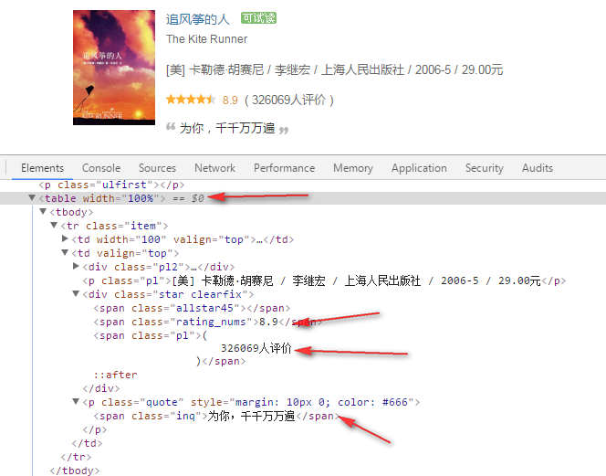

#### Python爬虫 requests etree 模块使用例子

例子百度到的，来自
https://blog.csdn.net/qq_39622065/article/details/79188111
稍微修改了下。去除延时，win下中文不乱码，抓到的数据保存到文件douban_book_top250.txt。

##### 核心代码

```py
file=s.xpath('//*[@id="content"]/div/div[1]/div/table') 

title = div.xpath("./tr/td[2]/div[1]/a/@title")[0]
href = div.xpath("./tr/td[2]/div[1]/a/@href")[0]
score=div.xpath("./tr/td[2]/div[2]/span[2]/text()")[0]
num=div.xpath("./tr/td[2]/div[2]/span[3]/text()")[0].strip("(").strip().strip(")").strip()
scrible=div.xpath("./tr/td[2]/p[2]/span/text()")
```
上面的代码和界面的元素是对应的



##### 小结

网页的元素显示都是有规律的，很多都可以归根为数组结构。使用etree模块时只需要告诉etree路径。